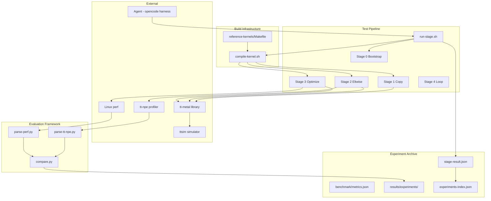
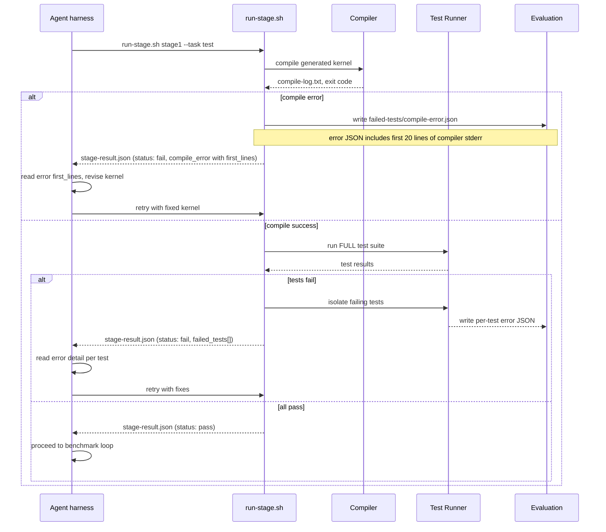
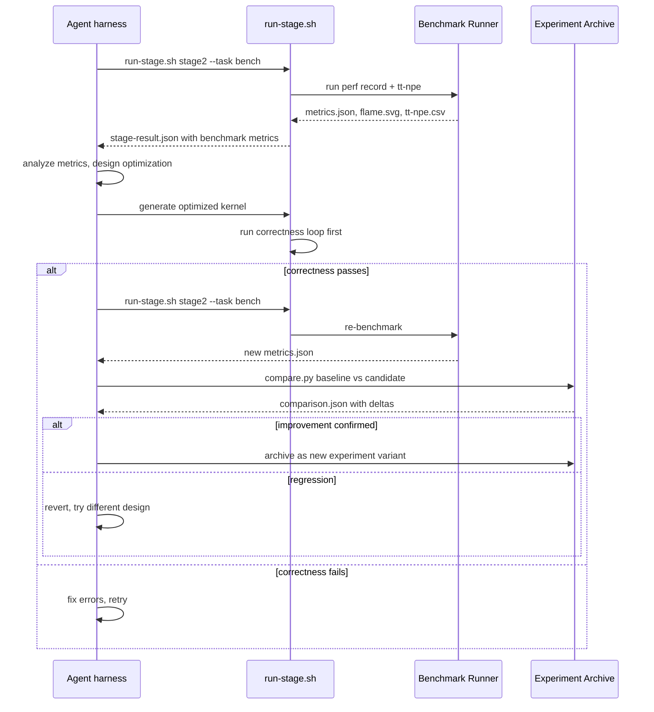
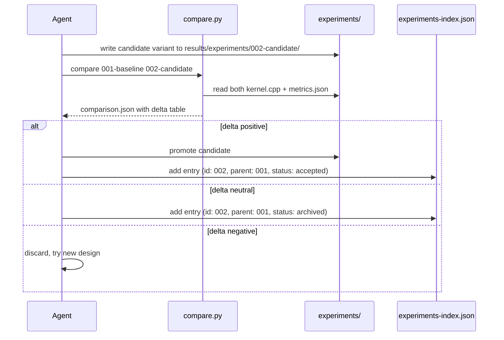

# Technical Specification — TT-Metalium LLM Agent Validation Pipeline

## 1. Overview

### 1.1 Purpose

This project provides a **deterministic test harness** for validating LLM agent capabilities in generating, testing, and optimizing TT-Metalium kernel code for Tenstorrent Blackhole hardware. The harness runs inside an opencode agent context and exposes script-based stage interfaces that produce verifiable JSON artifacts at every step.

### 1.2 Design Constraints

- **Every stage produces a verifiable artifact** — no step runs without a measurable output
- **Performance evaluation is deterministic** — all metrics come from tools (tt-npe, perf, objdump), never from LLM inference. **tt-npe metrics are the primary optimization signal**; perf data is supplementary
- **Two feedback loops**: inner correctness loop (fix compilation/test errors) and outer optimization loop (improve from profiling data)
- **A/B experiment archive** — every design variant is saved and comparable, with pinned tool versions for reproducibility
- **Agent drives iteration** — scripts are stateless evaluators; the opencode agent orchestrates the loop
- **Version-pinned dependencies** — tt-metal and ttsim are locked to specific commits/versions in `config/hardware.json` to prevent silent metric drift
- **Compile errors expose structured diagnostics** — the first 20 lines of compiler stderr are included in the error JSON for immediate agent feedback
- **All programs run via `mpirun --oversubscribe -np 1`** — tt-metal links against OpenMPI; `MPI_Init_thread` fails if launched directly. Every kernel binary must be invoked through mpirun
- **Two mandatory env vars beyond `TT_METAL_HOME`** — `TT_METAL_RUNTIME_ROOT` must point to the tt-metal source root (otherwise fails with "Root Directory is not set"); `LD_LIBRARY_PATH` must include build output directories for tt-metal shared libraries
- **Kernel host programs use `<tt-metalium/...>` includes** — the old `tt_metal/impl/device/` headers no longer exist in modern tt-metal. All public API headers live under `tt_metal/api/tt-metalium/` and are included as `#include <tt-metalium/host_api.hpp>`

### 1.3 The 5-Stage Pipeline

| Stage | Name | Objective | Success Metric |
|-------|------|-----------|---------------|
| 0 | Environment Bootstrap | Install tt-metal + ttsim + toolchain | `env-check.json` reports all tools ready |
| 1 | Copy Kernel | Agent generates DRAM loopback copy kernel | Compiles + output B matches input A exactly |
| 2 | Elementwise Addition | Agent generates compute kernel with circular buffers | Compiles + correct + `tt-npe` CSV parseable |
| 3 | Performance Optimization | Agent optimizes kernel from profiling data | Measurable NOC/BW improvement confirmed by `tt-npe` |
| 4 | Automated Iteration | Agent loops through stages 1-3 autonomously | 3+ successful iterations without intervention |

### 1.4 Directory Structure

```
tt/
├── technical-specification.md
├── config/
│   ├── stages.json            stage definitions + dependencies
│   └── hardware.json          target chip config
├── src/
│   ├── stages/
│   │   ├── run-stage.sh       single entry point for all stages
│   │   ├── stage0-bootstrap.sh
│   │   ├── stage1-run.sh
│   │   ├── stage2-run.sh
│   │   ├── stage3-run.sh
│   │   └── stage4-loop.sh
│   ├── evaluation/
│   │   ├── parse-tt-npe.py    parse tt-npe CSV to JSON
│   │   ├── parse-perf.py      parse perf stat output to JSON
│   │   └── compare.py         side-by-side experiment comparison
│   └── templates/
│       └── kernel-stub.cpp    template for generated kernels
├── scripts/
│   ├── compile-kernel.sh      compile wrapper with full include/link flags
│   ├── env-check.sh           verify toolchain readiness
│   ├── build-tt-metal.sh      clone + build tt-metal (pinned versions)
│   ├── install-ttsim.sh       download ttsim binary
│   ├── mock-agent.sh          copy reference kernel for CI pipeline testing
│   └── generate-flamegraph.sh perf.data -> flame.svg pipeline
├── prompts/
│   ├── stage1-copy-kernel.md
│   ├── stage2-eltwise-add.md
│   ├── stage3-optimize.md
│   └── system-context.md      shared architectural context
├── test/
│   ├── data/                  test vectors
│   └── reference-kernels/     known-good C++ implementations
│       ├── dram-loopback.cpp
│       └── eltwise-add.cpp
├── external/
│   ├── ttsim/                 cloned from tenstorrent/ttsim
│   └── tt-metal/              cloned from tenstorrent/tt-metal
├── results/                   gitignored — experiment outputs
│   ├── test-suite/
│   │   ├── full-results/
│   │   ├── failed-tests/
│   │   └── test-output.log
│   ├── benchmark/
│   │   ├── metrics.json
│   │   ├── tt-npe.csv
│   │   ├── perf.data
│   │   └── flame.svg
│   └── experiments/
│       └── 001-baseline/
└── .gitignore
```

### 1.5 Build Lessons — Bootstrap Pitfalls

These issues were discovered during initial environment bringup. Documented here so future runs skip the debugging.

**Firmware toolchain directory**: The `hw_toolchain` cmake target generates linker scripts into `runtime/hw/toolchain/{wormhole,blackhole}/`. If these directories don't exist, every RISC-V firmware file fails with `cc1: fatal error: opening output file ... No such file or directory`. Fix: `mkdir -p runtime/hw/toolchain/{wormhole,blackhole}` before building.

**Build target**: Use `make tt_metal` (not `make all`). The `tt_metal` target builds the host-side shared library (`libtt_metal.so`) and all its dependencies (firmware, UMD driver, device HAL) without building ttnn or model examples, which reduces build time from hours to ~20 minutes.

**Submodule init**: tt-metal uses git submodules (tracy, tt-umd, llama reference). A shallow `--depth 1` clone does not include them. Run `git submodule update --init --recursive` after cloning. If submodules are missing, cmake fails at configuration time with "Missing submodules."

**CPM cache dependencies**: During cmake configure, tt-metal downloads ~15 third-party libraries (fmt, spdlog, tt-logger, nlohmann_json, reflect, enchantum, simd-everywhere, taskflow, flatbuffers) into `.cpmcache/`. These paths must be added to the include directory list when compiling programs outside the tt-metal build tree. The `scripts/compile-kernel.sh` script hardcodes all discovered CPM paths.

**Build times** (on 16-core workstation):
| Step | Time |
|------|------|
| cmake configure | ~3 min |
| `make hw_toolchain` | ~2 min |
| `make tt_metal` | ~20 min |
| Total | ~25 min |

**ttsim build** is fast (~30 seconds) and independent of tt-metal. Build via `./make.py :build` in the ttsim root.

---

## 2. Component Specifications

### 2.1 StageResult — JSON Schema

Every stage script writes a `stage-result.json` to `results/stage-<N>/`. This is the universal output contract.

```json
{
  "stage": "stage1",
  "iteration": 3,
  "timestamp": "2026-06-07T10:30:00Z",
  "status": "pass",
  "task": "test",
  "artifacts": {
    "compile_log": "results/stage1/compile-log.txt",
    "test_suite": "results/stage1/test-suite/full-results.json",
    "failed_tests": ["results/stage1/test-suite/failed-tests/test_foo.json"],
    "benchmark": null
  },
  "metrics": {
    "compile_time_ms": 4520,
    "binary_size_kb": 128,
    "tests_total": 5,
    "tests_passed": 3,
    "tests_failed": 2
  }
}
```

Status values: `pass`, `fail`, `error`, `skipped`.

### 2.2 TestResult — JSON Schema

Individual test result, written to `results/test-suite/failed-tests/<test-name>.json` when a test fails.

```json
{
  "test_name": "eltwise_add_correctness",
  "status": "fail",
  "category": "correctness",
  "duration_ms": 234,
  "compile_error": null,
  "runtime_error": "Output mismatch at index 1024: expected 42, got 0",
  "diagnostics": {
    "stdout": "...",
    "stderr": "Mismatch detected in CB buffer...",
    "exit_code": 1
  },
  "failure_type": "runtime_assertion"
}
```

Failure types: `compile_error`, `link_error`, `runtime_assertion`, `timeout`, `output_mismatch`.

### 2.3 BenchmarkMetrics — JSON Schema

Written by the benchmark runner when tests pass, to `results/benchmark/metrics.json`.

**Primary metrics** (from tt-npe, drive optimization decisions): `noc_util_pct`, `dram_bw_util_pct`.
**Supplementary metrics** (from perf, diagnostic only): `cycles`, `instructions`, `ipc`.
Cycle counts on a simulator may not reflect real hardware — **tt-npe metrics are authoritative**.

```json
{
  "timestamp": "2026-06-07T10:35:00Z",
  "variant": "002-eltwise-naive",
  "tests_pass": true,
  "benchmark": {
    "wall_time_ms": 45230,
    "throughput_ops_per_sec": 83412,
    "dram_bw_util_pct": 0.38,
    "noc_util_pct": 0.44
  },
  "profile": {
    "cycles": 1245000,
    "instructions": 3890000,
    "ipc": 3.12,
    "cache_misses": 0.05,
    "branch_mispredicts": 0.02
  },
  "config": {
    "chip": "blackhole",
    "tt_npe_mode": "profiler",
    "perf_events": ["cycles", "instructions", "cache-misses"]
  }
}
```

### 2.4 ExperimentComparison — JSON Schema

Written by `compare.py` comparing two experiment variants.

```json
{
  "baseline": "001-copy-kernel-baseline",
  "candidate": "002-eltwise-v2",
  "timestamp": "2026-06-07T11:00:00Z",
  "deltas": {
    "wall_time_ms": { "baseline": 45230, "candidate": 41230, "delta_pct": -8.84 },
    "noc_util_pct": { "baseline": 0.44, "candidate": 0.39, "delta_pct": -11.36 },
    "ipc": { "baseline": 3.12, "candidate": 3.28, "delta_pct": 5.13 }
  },
  "regression": false,
  "thresholds": {
    "time_delta_max_pct": 2.0,
    "noc_delta_max_pct": 5.0
  }
}
```

### 2.5 StageScript Interface

Every stage script conforms to this interface:

| Interface | Type | Description |
|-----------|------|-------------|
| `run-stage.sh <stage-id> [--iter N] [--variant L] [--task T] [--kernel-path P]` | CLI | Entry point |
| `--task generate` | mode | Agent writes kernel to `src/generated/<stage>/kernel.cpp` |
| `--task test` | mode | Compile + run FULL test suite |
| `--task bench` | mode | Profile + benchmark passing kernel |
| `--kernel-path P` | opt | Override kernel source path |
| `TT_GENERATED_KERNEL_PATH` | env | Override kernel source path (highest priority) |
| **Script naming convention** | — | Stage scripts must be named `<stage-id>-run.sh` (e.g., `stage0-run.sh`). `run-stage.sh` resolves scripts using `$SCRIPT_DIR/$STAGE_ID-run.sh` |
| `stdout` | output | Human-readable progress |
| `results/stage-<N>/stage-result.json` | output | Structured result (mandatory) |
| `exit code 0` | status | All subtasks passed |
| `exit code 1` | status | Some tests failed (partial result JSON written) |
| `exit code 2` | status | Script error (no result JSON) |

### 2.6 ExperimentArchive — Directory Layout

```
results/experiments/<NNN>-<variant-label>/
├── kernel.cpp                    the generated kernel source
├── compile-log.txt               build output
├── test-results.json             full test suite output
├── metrics.json                  benchmark + profile metrics
├── comparison.json               delta vs parent variant
├── flame.svg                     flamegraph
├── perf.data                     raw perf data
├── tt-npe.csv                    tt-npe output
└── meta.json                     { variant, parent, stage, timestamp, agent_version }
```

### 2.7 CompileError — JSON Schema

On compile failure, a `compile_error.json` is written to `failed-tests/` with the first 20 lines of compiler stderr embedded inline so the agent has immediate feedback without parsing a large log file.

```json
{
  "test_name": "compile",
  "status": "fail",
  "category": "compile",
  "failure_type": "compile_error",
  "diagnostics": {
    "log": "results/stage1/compile-log.txt",
    "compiler_output_first_lines": "stage1-run.sh: line 82: g++ ...\nIn file included from kernel.cpp:1:\ntt_metal/impl/device/device.hpp:10: error: ..."
  }
}
```

The `compiler_output_first_lines` field contains the first ~20 lines of the compiler's stderr output, giving the agent enough context to diagnose and fix the error without reading the full log.

### 2.8 Compile & Link Contract

Kernel programs are compiled by `scripts/compile-kernel.sh`, which encapsulates all include paths, library paths, and link flags discovered from the tt-metal build. The contract is:

| Category | Details |
|----------|---------|
| Include root | `-I$TT_METAL_SOURCE/tt_metal/api` for `<tt-metalium/...>` style includes |
| Public API headers | `<tt-metalium/host_api.hpp>`, `<tt-metalium/device.hpp>`, `<tt-metalium/distributed.hpp>`, `<tt-metalium/bfloat16.hpp>`, `<tt-metalium/tensor_accessor_args.hpp>` |
| CPM dependencies | fmt, spdlog, tt-logger, nlohmann_json, reflect, enchantum, simd-everywhere, taskflow, flatbuffers (paths under `.cpmcache/<pkg>/<hash>/include`) |
| Shared libraries needed | `libtt_metal.so`, `libtt-umd.so`, `libtt_stl.so`, `libtracy.so`, `libttsim.so` |
| System libraries needed | `libmpi.so`, `libmpi_cxx.so`, `libhwloc`, `libnuma`, `libz`, `libpthread`, `libdl`, `librt` |
| Link order | `-ltt_metal -ltt-umd -ltt_stl -ltracy -lttsim -lpthread -ldl -lrt -lz -lhwloc -lnuma -lmpi -lmpi_cxx` |
| Library search dirs | `build/tt_metal`, `build/tt_metal/third_party/umd/lib`, `build/lib`, `build/tt_stl`, `external/ttsim/src/_out/release_bh`, `/usr/lib/x86_64-linux-gnu/openmpi/lib` |
| RPATH (embedded) | Same as library search dirs, so `LD_LIBRARY_PATH` is optional for direct invocation (but required for mpirun) |
| Execution wrapper | **Always** `mpirun --oversubscribe -np 1 ./<binary>`. Direct execution crashes at `MPI_Init_thread` |
| Compiler | `g++ -std=c++20 -O2 -g -fno-omit-frame-pointer` |
| Defines | `-DFMT_HEADER_ONLY=1 -DSPDLOG_COMPILED_LIB -DSPDLOG_FMT_EXTERNAL -DTRACY_ENABLE -DTRACY_IMPORTS -DTT_UMD_BUILD_SIMULATION` |

**Implementation note**: These paths were discovered by extracting `flags.make` from the tt-metal build tree (`build/tt_metal/CMakeFiles/tt_metal.dir/flags.make`). If the CPM cache hashes change (e.g., after a tt-metal version bump), rebuild the include list from that file.

### 2.9 Required Runtime Environment

These environment variables must be set for any kernel binary to execute on ttsim:

| Env var | Value (relative to project root) | Required? | Purpose |
|---------|----------------------------------|-----------|---------|
| `TT_METAL_HOME` | `<project>/external/tt-metal` | Yes | Root for JIT kernel compilation paths; used by device runtime to find kernel source files |
| `TT_METAL_RUNTIME_ROOT` | `<project>/external/tt-metal` | Yes | Root directory for firmware binaries and device toolchain. Falls back to cmake install prefix (`/usr/libexec/tt-metalium`) if unset — fails with "Root Directory is not set" at startup |
| `TT_METAL_SIMULATOR` | `<project>/external/ttsim/src/_out/release_bh/libttsim.so` | Yes | Path to the ttsim simulator shared library. Device UMD loads this as the simulation backend |
| `TT_METAL_SLOW_DISPATCH_MODE` | `1` | Yes | Required for simulator determinism. Fast dispatch is not validated on ttsim |
| `TT_METAL_DISABLE_SFPLOADMACRO` | `1` | Yes | Disables unsupported SFPU instruction that crashes on ttsim |
| `TT_METAL_DPRINT_CORES` | `0,0` | Optional | Enables device printf from the specified Tensix core (useful for debugging) |
| `LD_LIBRARY_PATH` | see §2.8 | Yes (with mpirun) | Runtime linker path for tt-metal shared libraries. Required when running via mpirun because mpirun strips RPATH |

**Stage scripts** handle all of these automatically via inline env vars before each `mpirun` call.

---

## 3. System Architecture



---

## 4. Detailed Data Flow

### 4.1 Correctness Feedback Loop



### 4.2 Optimization Feedback Loop



### 4.3 A/B Experiment Archive Flow



---

## 5. Visualization (Optional — Monitoring Only)

> The D3 animation is a **visualization-only** tool. The agent's feedback loop does not depend on it. It reads from `results/experiments/experiments-index.json` to render an HTML dashboard.

### 5.1 Pipeline State Machine

The D3 animation visualizes the full pipeline state machine showing stage transitions, pass/fail counts, iteration counter, and metric deltas between A/B experiments. It can be generated on demand via a standalone script.

Keyframes:
- Stage transition: pipeline advances to next stage
- Correctness loop: iteration counter increments on retry
- Test failure: red flash on failing test count
- Benchmark complete: metric bars update with delta arrows
- A/B comparison: side-by-side bar chart of baseline vs candidate

The D3 animation is embedded below as a self-contained HTML file. It exposes `window.jumpToKeyframe(idx)`, `window.resetAnimation()`, and `window.getAnimationState()` for automated verification. Run `scripts/visualize-results.py` to regenerate from current experiment data.

```html
<!DOCTYPE html>
<html>
<head>
<meta charset="utf-8">
<title>Pipeline State Machine</title>
<style>
  body { font-family: monospace; background: #1e1e2e; color: #cdd6f4; margin: 20px; }
  .controls { margin-bottom: 20px; }
  .controls button { padding: 8px 16px; margin-right: 8px; background: #45475a; color: #cdd6f4; border: none; cursor: pointer; }
  .controls button:hover { background: #585b70; }
  .controls span { margin-left: 12px; }
  #kf-total { font-weight: bold; }
  #kf-label { margin-left: 8px; font-style: italic; color: #a6adc8; }
  .pipeline { display: flex; gap: 12px; padding: 20px 0; flex-wrap: wrap; }
  .stage { width: 120px; height: 60px; border: 2px solid #45475a; border-radius: 8px; display: flex; align-items: center; justify-content: center; font-size: 11px; text-align: center; transition: all 0.3s; background: #313244; }
  .stage.active { border-color: #89b4fa; background: #45475a; box-shadow: 0 0 12px #89b4fa80; }
  .stage.pass { border-color: #a6e3a1; background: #45475a; }
  .stage.fail { border-color: #f38ba8; background: #45475a; }
  .metrics { display: flex; gap: 24px; margin: 20px 0; }
  .metric { text-align: center; }
  .metric .value { font-size: 24px; font-weight: bold; }
  .metric .label { font-size: 11px; color: #a6adc8; }
  .metric .delta { font-size: 13px; }
  .delta.pos { color: #a6e3a1; }
  .delta.neg { color: #f38ba8; }
  .bar-chart { display: flex; align-items: flex-end; gap: 16px; height: 120px; padding: 20px; border: 1px solid #45475a; border-radius: 8px; }
  .bar-group { display: flex; gap: 4px; align-items: flex-end; }
  .bar { width: 30px; transition: height 0.5s; border-radius: 4px 4px 0 0; }
  .bar.baseline { background: #89b4fa; }
  .bar.candidate { background: #a6e3a1; }
  .legend { display: flex; gap: 16px; margin-top: 8px; font-size: 11px; }
  .legend-item { display: flex; align-items: center; gap: 4px; }
  .legend-swatch { width: 12px; height: 12px; border-radius: 2px; }
  .log { margin-top: 20px; font-size: 11px; max-height: 120px; overflow-y: auto; border-top: 1px solid #45475a; padding-top: 8px; }
  .log-entry { padding: 2px 0; }
</style>
</head>
<body>
<div class="controls">
  <button data-testid="play-pause" class="play-pause" id="playBtn">Play</button>
  <button id="resetBtn">Reset</button>
  <span>Keyframe: <span id="kf-idx">0</span>/<span id="kf-total">19</span></span>
  <span id="kf-label">pipeline-initialized</span>
</div>

<div class="pipeline" id="pipeline"></div>

<div class="metrics" id="metrics"></div>

<div class="bar-chart" id="barChart"></div>
<div class="legend">
  <div class="legend-item"><div class="legend-swatch" style="background:#89b4fa"></div> Baseline</div>
  <div class="legend-item"><div class="legend-swatch" style="background:#a6e3a1"></div> Candidate</div>
</div>

<div class="log" id="log"></div>

<script>
(function() {
  const STAGE_NAMES = ['Stage 0 Bootstrap', 'Stage 1 Copy', 'Stage 2 Eltwise', 'Stage 3 Optimize', 'Stage 4 Loop'];

  const keyframes = [
    { time: 0, label: 'pipeline-initialized' },
    { time: 1, label: 'stage0-started' },
    { time: 2, label: 'stage0-complete' },
    { time: 3, label: 'stage1-started' },
    { time: 4, label: 'stage1-correctness-fail', activeStage: 1, passCount: 0, failCount: 1 },
    { time: 5, label: 'stage1-correctness-retry', activeStage: 1, passCount: 0, failCount: 1, iteration: 2 },
    { time: 6, label: 'stage1-correctness-pass', activeStage: 1, passCount: 5, failCount: 0, iteration: 3 },
    { time: 7, label: 'stage1-benchmark', activeStage: 1, passCount: 5, failCount: 0, iteration: 3, showMetrics: true },
    { time: 8, label: 'stage2-started', activeStage: 2 },
    { time: 9, label: 'stage2-correctness-fail', activeStage: 2, passCount: 0, failCount: 1 },
    { time: 10, label: 'stage2-correctness-pass', activeStage: 2, passCount: 5, failCount: 0, iteration: 2 },
    { time: 11, label: 'stage2-benchmark-baseline', activeStage: 2, passCount: 5, failCount: 0, iteration: 2, showMetrics: true, showBars: true },
    { time: 12, label: 'stage3-optimize-proposal', activeStage: 3, passCount: 5, failCount: 0, iteration: 1, showMetrics: true, showBars: true },
    { time: 13, label: 'stage3-correctness-loop', activeStage: 3, passCount: 3, failCount: 2, iteration: 2, showMetrics: true, showBars: true },
    { time: 14, label: 'stage3-correctness-pass', activeStage: 3, passCount: 5, failCount: 0, iteration: 3, showMetrics: true, showBars: true },
    { time: 15, label: 'stage3-benchmark-candidate', activeStage: 3, passCount: 5, failCount: 0, iteration: 3, showMetrics: true, showBars: true, showCandidate: true },
    { time: 16, label: 'stage3-comparison', activeStage: 3, passCount: 5, failCount: 0, iteration: 3, showMetrics: true, showBars: true, showCandidate: true, showDelta: true },
    { time: 17, label: 'stage4-loop-start', activeStage: 4, passCount: 5, failCount: 0, iteration: 1, showMetrics: true, showBars: true, showCandidate: true, showDelta: true },
    { time: 18, label: 'stage4-loop-iteration-3', activeStage: 4, passCount: 5, failCount: 0, iteration: 3, showMetrics: true, showBars: true, showCandidate: true, showDelta: true },
    { time: 19, label: 'stage4-loop-complete', activeStage: 4, passCount: 5, failCount: 0, iteration: 5, showMetrics: true, showBars: true, showCandidate: true, showDelta: true }
  ];

  window.ANIMATION_DURATION_MS = 20000;
  window.ANIMATION_KEYFRAMES = keyframes.map((k, i) => ({ time: k.time, label: k.label }));
  window.ANIMATION_VERIFICATION = keyframes.map(k => ({
    label: k.label,
    hor: k.activeStage || 0,
    ver: k.iteration || 1,
    precision: k.passCount || 0,
    bounds: k.failCount || 0,
    logCount: keyframes.indexOf(k) + 1
  }));

  let currentKf = 0;
  let playing = false;
  let timer = null;

  function render(kfIdx) {
    const kf = keyframes[kfIdx];
    const pipeline = document.getElementById('pipeline');
    const metrics = document.getElementById('metrics');
    const barChart = document.getElementById('barChart');
    const log = document.getElementById('log');

    pipeline.innerHTML = STAGE_NAMES.map((name, i) => {
      let cls = 'stage';
      if (kf.activeStage === i) cls += ' active';
      if (kf.passCount > 0 && kf.activeStage === i) cls += ' pass';
      if (kf.failCount > 0 && kf.activeStage === i) cls += ' fail';
      return `<div class="${cls}">${name}</div>`;
    }).join('');

    if (kf.showMetrics) {
      metrics.style.display = 'flex';
      metrics.innerHTML = `
        <div class="metric"><div class="value">${kf.passCount}</div><div class="label">Tests Passed</div></div>
        <div class="metric"><div class="value">${kf.failCount}</div><div class="label">Tests Failed</div></div>
        <div class="metric"><div class="value">${kf.iteration || 1}</div><div class="label">Iteration</div></div>
        <div class="metric"><div class="value">${kf.showDelta ? '-8.8%' : '--'}</div><div class="label">Wall Time Delta <span class="delta pos">${kf.showDelta ? 'improved' : ''}</span></div></div>
      `;
    } else {
      metrics.style.display = 'none';
    }

    if (kf.showBars) {
      barChart.style.display = 'flex';
      const metrics_labels = ['Wall Time', 'NOC Util', 'DRAM BW', 'IPC'];
      const baseline_vals = [100, 44, 38, 31];
      const candidate_vals = kf.showCandidate ? [91, 39, 41, 33] : null;
      barChart.innerHTML = metrics_labels.map((label, i) => `
        <div class="bar-group">
          <div style="text-align:center">
            <div class="bar baseline" style="height:${baseline_vals[i]}px"></div>
            ${candidate_vals ? `<div class="bar candidate" style="height:${candidate_vals[i]}px"></div>` : ''}
            <div style="font-size:10px;margin-top:4px">${label}</div>
          </div>
        </div>
      `).join('');
    } else {
      barChart.style.display = 'none';
    }

    log.innerHTML = keyframes.slice(0, kfIdx + 1).map((k, i) =>
      `<div class="log-entry">[${i}] ${k.label}${k.failCount > 0 ? ' -- tests failed' : ''}${k.showDelta ? ' -- performance improved' : ''}</div>`
    ).join('');

    document.getElementById('kf-idx').textContent = kfIdx;
    document.getElementById('kf-total').textContent = keyframes.length - 1;
    document.getElementById('kf-label').textContent = kf.label;
  }

  window.jumpToKeyframe = function(idx) {
    if (idx < 0) idx = 0;
    if (idx >= keyframes.length) idx = keyframes.length - 1;
    currentKf = idx;
    render(currentKf);
  };

  window.resetAnimation = function() {
    if (timer) { clearInterval(timer); timer = null; }
    playing = false;
    document.getElementById('playBtn').textContent = 'Play';
    currentKf = 0;
    render(currentKf);
  };

  window.getAnimationState = function() {
    const kf = keyframes[currentKf];
    return {
      hor: kf.activeStage || 0,
      ver: kf.iteration || 1,
      precision: kf.passCount || 0,
      boundsOpacity: kf.failCount > 0 ? 1 : 0,
      logCount: currentKf + 1,
      keyframeIdx: currentKf,
      keyframeLabel: kf.label
    };
  };

  document.getElementById('playBtn').addEventListener('click', function() {
    if (playing) {
      clearInterval(timer);
      timer = null;
      playing = false;
      this.textContent = 'Play';
    } else {
      playing = true;
      this.textContent = 'Pause';
      timer = setInterval(function() {
        currentKf++;
        if (currentKf >= keyframes.length) {
          currentKf = 0;
        }
        render(currentKf);
      }, 1000);
    }
  });

  document.getElementById('resetBtn').addEventListener('click', window.resetAnimation);

  render(0);
})();
</script>
</body>
</html>
```

---

## 6. Testing Requirements

### 6.1 Reference Kernel Test Suite

The `test/reference-kernels/` directory contains known-good TT-Metalium implementations. These serve as the correctness oracle for generated kernels.

**API patterns** (discovered during initial bringup):
- Include style: `#include <tt-metalium/host_api.hpp>` (not `"tt_metal/impl/device/device.hpp"` — those headers no longer exist)
- Device creation: `distributed::MeshDevice::create_unit_mesh(device_id)` instead of the old `CreateDevice(0)`
- Buffer allocation: `distributed::MeshBuffer::create(rep_config, local_config, mesh_device.get())`
- Data movement: `distributed::EnqueueWriteMeshBuffer`, `distributed::EnqueueReadMeshBuffer`
- Program execution: `distributed::MeshWorkload` + `distributed::EnqueueMeshWorkload` + `distributed::Finish`
- Tensor accessors: `TensorAccessorArgs(*mesh_buffer)` (the `*` dereferences MeshBuffer to its backing buffer directly — do not use `->get_backing_buffer()`)
- Address type: `buffer->address()` returns `uint64_t` (`DeviceAddr`). Must cast to `uint32_t` when passing to `SetRuntimeArgs` as kernel runtime args
- Verification: use bfloat16-tolerant epsilon (`5.0` not `1e-2`) because bfloat16 has only 7 mantissa bits; at value 258, adjacent representable values are spaced by 2.0

| File | Purpose | Verification | Runtime arg order |
|------|---------|--------------|-------------------|
| `dram-loopback.cpp` | Copy buffer A to buffer B | B[i] == A[i] for all i | `(l1_addr, src_dram_addr, dst_dram_addr, num_tiles)` — L1 scratch buffer is required |
| `eltwise-add.cpp` | Elementwise A + B = C | C[i] == A[i] + B[i] for all i (bfloat16 epsilon 5.0) | Reader: `(src0_addr, src1_addr, n_tiles)`; Writer: `(dst_addr, n_tiles)`; Compute: `(n_tiles)` |

### 6.2 Stage Script Unit Tests

Each stage script must be testable with mock data:

| Test | Script | Input | Expected Output |
|------|--------|-------|----------------|
| Stage 0 env check | `scripts/env-check.sh` | Clean VM | JSON with all tools missing |
| Stage 0 version pin | `src/stages/stage0-bootstrap.sh --task test` | Pinned config | Version check in env-check.json |
| Stage 0 sanity test | `src/stages/stage0-bootstrap.sh --task test` | Hardware available | `sanity_passed: true` |
| Stage 1 compile | `scripts/mock-agent.sh stage1` → `run-stage.sh --task test` | Mock copies reference kernel | `stage-result.json` status=pass |
| Stage 1 fail | `src/stages/run-stage.sh --task test` | Bad kernel | `status=fail`, error JSON with `compiler_output_first_lines` |
| Error isolation | `src/stages/run-stage.sh --task test` | Kernel with one failing test | Only that test in `failed-tests/` |
| Compile error format | `src/stages/run-stage.sh --task test` | Syntax error kernel | `compile_error.json` has first 20 lines of stderr |
| Pipeline dry-run | `scripts/mock-agent.sh stage1` + `scripts/mock-agent.sh stage2` → full loop | Mock kernels | End-to-end pass with artifacts |
| Comparison | `src/evaluation/compare.py` | Two metric JSONs | `comparison.json` with deltas |

### 6.3 JSON Schema Validation

All output JSON files must validate against their schemas:

- `stage-result.json` — has `stage`, `status`, `artifacts`, `metrics`
- `test-result.json` — has `test_name`, `status`, `failure_type`, `diagnostics`
- `metrics.json` — has `benchmark`, `profile`, `config`
- `comparison.json` — has `baseline`, `candidate`, `deltas`, `regression`

### 6.4 Integration Test: Full Pipeline Dry-Run

A deterministic dry-run that exercises the full pipeline using the mock agent (no LLM required):

1. `scripts/mock-agent.sh stage1` — copies reference kernel to `src/generated/stage1/kernel.cpp`
2. `run-stage.sh stage1 --task test` — compiles reference kernel, runs tests — must pass
3. `scripts/mock-agent.sh stage2` — copies reference kernel to `src/generated/stage2/kernel.cpp`
4. `run-stage.sh stage2 --task test` — compiles, runs tests — must pass
5. `run-stage.sh stage2 --task bench` — must produce parseable metrics
6. `compare.py` on two identical runs — must show 0% delta
7. Full loop: stage1 → stage2 → bench → compare → archive — end-to-end
8. `run-stage.sh stage1 --task test` with a **deliberately broken kernel** — must produce `compile_error.json` with non-empty `compiler_output_first_lines`

### 6.5 Performance Regression Thresholds

Per-stage thresholds are defined in `config/stages.json`. The following defaults apply:

| Metric | Threshold | Stage | Action |
|--------|-----------|-------|--------|
| Wall time | +2% from baseline | All | Flag regression |
| NOC util | +5% from baseline | All | Flag regression |
| NOC util improvement | ≥10% required | Stage 3 | Reject optimization if below |
| Test count | Any decrease | All | Hard fail |
| Compilation | Any failure | All | Hard fail |
| Max compile attempts | 5 | Stage 1, 2 | Abort stage |
| Max optimization attempts | 10 | Stage 3 | Abort stage |
| Max total iterations | 20 | Stage 4 | Abort pipeline |
| Convergence window | 3 iterations | Stage 4 | Stop if target metrics stable

---

## 7. CLI Entry Point

### `run-stage.sh`

The single entry point for all stage operations. Stage scripts handle compilation via `scripts/compile-kernel.sh` and execution via `mpirun --oversubscribe -np 1` with all required env vars set inline.

**Usage:**
```
bash src/stages/run-stage.sh <stage-id> [options]

Options:
  --iter N         Iteration number (default: 1)
  --variant LABEL  Experiment variant label (default: baseline)
  --task TASK      Task: generate, test, bench (default: test)
  --config PATH    Config directory (default: config/)
```

**Stage IDs:** `stage0`, `stage1`, `stage2`, `stage3`, `stage4`

**Exit codes:**
- `0` — All tasks passed
- `1` — Some tests failed (partial results available)
- `2` — Script error (no results produced)

**Output directory:** `results/stage-<stage-id>/` always contains:
- `stage-result.json` — structured result (mandatory)
- `compile-log.txt` — build output (if compilation ran)
- `test-suite/` — test results (if tests ran)
- `benchmark/` — benchmark data (if bench ran)

**Required runtime environment for compiled binaries (stage scripts handle this automatically):**

Every compiled kernel binary requires these env vars and mpirun to execute:
```bash
# Manual execution (stage scripts do this internally):
export TT_METAL_HOME=<project>/external/tt-metal
export TT_METAL_RUNTIME_ROOT=$TT_METAL_HOME
export TT_METAL_SIMULATOR=<project>/external/ttsim/src/_out/release_bh/libttsim.so
export TT_METAL_SLOW_DISPATCH_MODE=1
export TT_METAL_DISABLE_SFPLOADMACRO=1
export LD_LIBRARY_PATH=\
  $TT_METAL_HOME/build/tt_metal:\
  $TT_METAL_HOME/build/tt_metal/third_party/umd/lib:\
  $TT_METAL_HOME/build/lib:\
  $TT_METAL_HOME/build/tt_stl:\
  /usr/lib/x86_64-linux-gnu/openmpi/lib

mpirun --oversubscribe -np 1 ./kernel_test
```

**Stage scripts use inline env vars** to avoid global state pollution:
```bash
# Stage1-run.sh does:
TT_METAL_HOME=... TT_METAL_RUNTIME_ROOT=... LD_LIBRARY_PATH=... \
  mpirun --oversubscribe -np 1 ./kernel_test
```

**Examples:**
```bash
# Run full test suite for stage 1, iteration 3
bash src/stages/run-stage.sh stage1 --iter 3 --task test

# Benchmark a specific variant
bash src/stages/run-stage.sh stage2 --variant eltwise-v2 --task bench

# Generate kernel via agent (agent writes to src/generated/)
bash src/stages/run-stage.sh stage1 --task generate
```
